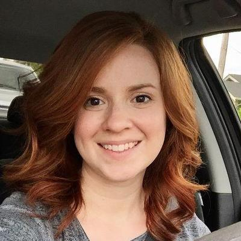
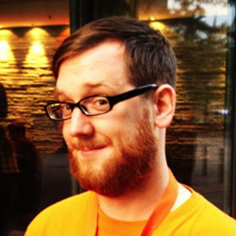

{::options parse_block_html="true" /}

*What impact has CallbackWomen had on you?  [Email](callbackwomen@gmail.com) with your story.*

{::options toc_levels="2..3" /}
* toc
{:toc}

### Heidi Waterhouse, speaker

"CallbackWomen has given me more than just a place to watch for friendly conferences, it's given me a community of other women who are **advocating for the same things I am: a spot at the speaker's podium, payment for my work, respect for my emotional labor**.

When I go to a conference, my odds are good that I will find another member of our loose affiliation to talk to and connect with. I only started speaking three years ago, but even in that time, I feel like conferences have accepted more women speakers, and done more to support and promote speakers from under-represented groups."

### Lacey Williams Henschel, speaker & organizer

"As a new speaker, CallbackWomen was instrumental in helping me find speaking opportunities at **conferences that would provide mentorship, help me financially, and support me** in other ways. As a conference organizer for DjangoCon US, I've relied on CallbackWomen to help us spread the word about our CFP and our commitment to **recruiting diverse and intersectional talks from new speakers**. CallbackWomen has helped my conference establish itself as a welcoming and friendly place for women speakers."

### Jan Lehnardt, organizer

"I am a co-organiser of the yearly and immensely popular conference JSConf EU in Berlin, Germany. I am an advisor to other events in the JSConf series of events, including, but not limited to JSConf US, JSUnConf EU, JSConf Budapest, WebRebels, and JSConf Iceland. I’m also informally advising many other tech events, from small user groups to larger events. One of the aspects my advice is usually requested for is diversity and inclusion. I’m not an expert, but over the years have put in the time to read up on the topic from the now multitude of great online resources and by gaining first-hand experience running small and large events.

On behalf on JSConf EU and all the other events I advise, I’d like to express my gratitude to the CallbackWomen initiative. When JSConf EU started putting diversity and inclusivity on to its list of top priorities in 2012, Courtney Stanton’s “anonymous CfP” blog post and a code of conduct from the Geek Feminism Wiki were some of the very few resources we’ve had that helped us to achieve our goals. When CallbackWomen started, we had an immediately strong ally for our cause.

**In 2012 openly declaring that diversity and inclusion is an important topic for tech events was a novelty. In 2016 it is no longer.** Events that don’t meet expectations of speaker diversity and measures to ensure a safe event space and an inclusive environment are sticking out like a sore thumb. 

**CallbackWomen is one of the cornerstones of our industry that helped make this change.** CallbackWomen and [@cczona](http://twitter.com/cczona) personally are not only helping events to have a diverse speaker line-up, and are not only helping women to find great events to speak professionally, but they are also putting in the time to help convince and educate events that are new to the topic.

**CallbackWomen is an invaluable addition to our industry and the amount of positive change and personal opportunity it has created is unmeasurable.**"

### Anonymous Woman, speaker
"It's hard to put into words my positive experience with all the great action that CallbackWomen has done to me and for community, in general. I may not be brief; my apologies if your time is short.

#### Background History

After some years working in software development, I got a little bored of seeing the same talks provided by a constant group of speakers covering almost the same knowledge base.

"What else are people doing?" I wanted to know where to find videos and slides of brilliant minds. I knew they existed. I just did not know properly where to find them.

"There are many conferences around the world! Is there a central point talking about people's work among those conferences?" Those questions stood in my mind for some time. Until early in 2015, when a friend retweed a tweet from CallbackWomen. It had a link for a Call for Proposals of a conference. I opened the conference's webpage.

"Cool! There are videos of previous editions. WOW!" I've watched several videos with brilliant ideas! This is what I'm looking for! Nice account who retweeted this. Let me follow it!"

**Then I started following CallbackWomen. Since then I cannot measure how much I have learned.** I do imagine several people could find out a lot of brilliant presentation, talks and speakers. CallbackWomen provided me high quality content. It broke my boredom, by bringing in diversity of speakers and content. No need to say that impacted positively my career and my well being. Learning is something that I do care about a lot.

#### Sharing Expertise at Confences

After watching several videos, finding out about a bunch of great conferences around the globe, and digging into their previous editions, **I took the courage to submit some proposals to international conferences. Once again motivated by CallbackWomen**. I had learned so much! What about sharing some things?

And yay! I got some talks accepted. It opened an entire new horizon to me. By going to new conferences, I met new people and learned much more than I could ever had imagined!

#### Spreading Knowledge to Local Communities

After some conferences, it was time to share what I have learned as much as possible. I started new local meetups in my country. I was already organising two; decided to create other extra two and engage firmly into two other communities. I can precisely say that **the incentives from sharing knowledge that came from CallbackWomen were crucial** to this decision. Nowadays I try to be active into six meetups: Neo4j, Cassandra, Rust, Science, Haskell and WebDev. A couple years ago I would never have figured I'd be doing all those things! And I cannot put into words how happy I am. :)

#### Meeting People

Meeting new people is very important to a software developer: new job opportunities, find new tools and technologies, determine best and more accurate solutions for problems. Attending conferences helps a lot on that. CallbackWomen has done wonderful work in announcing conferences and Call for Proposals. 

By the way, I was super happy to meet CallbackWomen's founder, [@cczona](http://twitter.com/cczona), this year. I was able to give her a sincere "thank you". In person.

#### Conclusion

No matter what are your political/social views about several subjects, almost all of us agree that spreading knowledge is something healthy. And we need diversity. We need to bring up the work of those brilliant people!

I don't want to start any deep discussion about what are the best methods to provide inclusion and spread knowledge, but sharing content the way CallbackWomen does is sure beneficial. It made me think about several topics and change the way I behave. I have learned a lot about tools, technologies, career, and about people as well! And this knowledge won't stay trapped in my mind like an island. I am spreading the topics that I learn! 

So I would like to close this with a huge and sincere 'thank you'."
